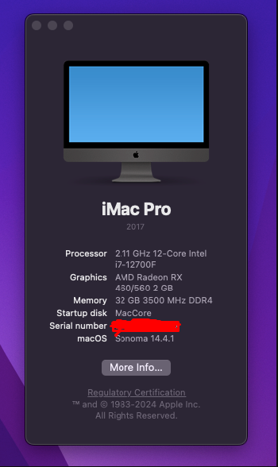
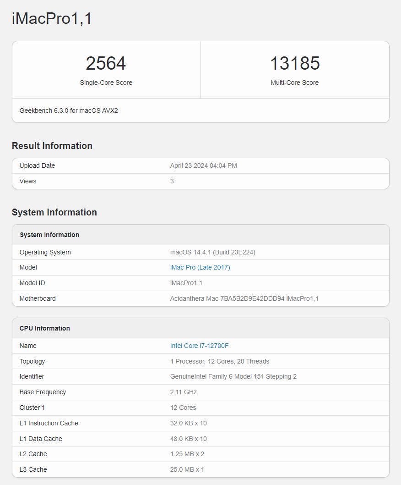

# Hackintosh OpenCore + MSI B660 PRO-A DDR4 + Intel Core i7-12700F

| Bootloader | Version | Boot Mode | SMBIOS    | macOS   | Version | Release Date |
|:----------:|:-------:|:---------:|:---------:|:-------:|:-------:|:------------:|
| OpenCore   | 0.9.9   | UEFI      | iMacPro1,1| Sonoma |  14.4.1  | 25.04.2024   |

## Supported OS

|   Min OS   |  Target OS | Max OS |
|:----------:|:----------:|:------:|
| BigSur (11)| Sonoma (14)| Latest |

## System Specs

| Type | Item |
| ---- | ---- |
| Motherboard | MSI b660 PRO-A DDR4 |
| CPU | Intel Core i7-12700F @ 2.10 GHz, 25M Cache, up to 4.90 GHz|
| RAM | 2x16 GB Crucial Ballistix DDR4 3500MHz 14-16-16-30 |
| GPU | Asus RX 460 DUAL 2 GB |
| DRIVE | Adata XPG Gammix S11 Pro 1 TB  |
| Sound | Asus Xonar SE |
| LAN | Realtek® 8125BG 2.5SGbps LAN controller |
| BIOS Version | 7D59v1G |

## BIOS Tweaks

Secure Boot -> Disable
Fast Boot -> Disable
V.D.T -> Enable

| Feature | Status |
| ------------- | ------------- |
| CPU Power Management | ✅ Working |
| Sleep/Wake | ✅ Working |
| AMD RX 460 Graphics Acceleration | ✅ Working |
| Ethernet | ✅ Working |
| Audio | ✅ Working |
| Speakers and Headphones | ✅ Working |
| iMessage/Facetime and App Store | ✅ Working  |
| FileVault 2 | ✅ Working |
| DRM | ✅ Working |
| BootCamp | ✅ Working 

## Notes

-Power management only works with SMBIOS iMacPro1,1 with any other CPU,s TDP limited to 50-100 whatt, which leads to 30-50% performance loss

-All kexts and open core files from REALESE branches, all debug features are disables for maximum performance and load speeds

## Guide

1) Download this repo and extract it's content to your formatted USB drive

2) Download Macrecovery and download recover files for the system that you want

3) Move recovery files to com.apple.recovery.boot

4) Check support for your graphics and modify config.plist, if needed

-My RX 460, like many AMD dGPU works out of the box, with no tweaks added in config, AMD NAVI+ GPUs may need to add agdpmod=pikera in boot args in order to work,
very small percentage (like RX 550) may need to use fake id, RX 6000 is the lastest generation of graphics cards supported in mac os, RX 7000 and future GPUs will not be supported in MacOS

5) Apply BIOS tweaks

Secure Boot -> Disable
Fast Boot -> Disable
V.D.T -> Enable

- If you don't have this options in the BIOS try update in on newer version

6) Try to boot from USB with MacOS, thet after boot menu shows press SPACE, and from new menu select %NAME_USB%.dmg, then apple logo should appear

7) Click to Disk Managment and erase disk where you want to install OS

8) Then select reinstall MacOS and follow instructions

9) After about 30 mins computer will automaticly shutdown and you need to boot from USB again and select "Install MacOs"

10) After installation in boot menu should apper new optiom with disk name with the installed MacOs

-If you use the same Motherboard chance of getting boot errors are minimal, but if you have problems with boot:

1) Update BIOS to version that i use, restore defaults in BIOS and apply needed tweaks (see step 5)
2) Try change SMBIOS to MacPro7,1 or iMac20,2
3) If you still can't boot there's no change to identify problen without debug info: look through every opem core file and kexts and replace it with debug version, also add -debug=0x100 in boot args and start debugging 
